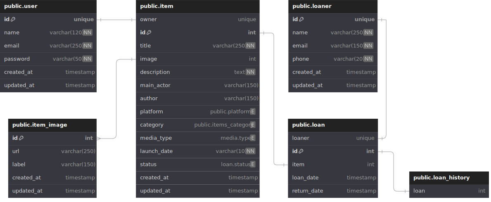

# COLLECTABLE ITEMS API

An API project which main purpose is to provide a storage system for collectable items information, relating owner with their items, also it provides information about loans and loaners.

## DATABASE PHYSICAL STRUCTURE DIAGRAM

